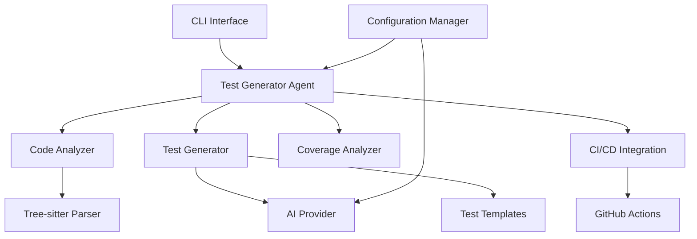

# Design Document

## Overview

The Test Case Generator Bot is an AI-powered developer agent that automatically analyzes code in Python, Java, and JavaScript to generate comprehensive test suites. The system uses a modular architecture with AI integration to provide intelligent test generation, edge case detection, coverage analysis, and conversational refinement capabilities.

The design follows a multi-layered approach with clear separation of concerns:
- **Agent Layer**: Orchestrates the overall workflow and user interactions
- **Analysis Layer**: Parses and analyzes code structure and complexity
- **Generation Layer**: Creates test cases using AI-enhanced logic
- **Integration Layer**: Provides CI/CD and external tool integration

## Architecture

### High-Level Architecture



### User Interface Design

The system provides a CLI-based interface optimized for developer workflows:

**Primary Interface - CLI (Command Line Interface)**:
- Rich terminal UI using the Rich library for enhanced formatting and progress indicators
- Click framework for robust command-line argument parsing and help documentation
- Interactive prompts for conversational refinement of test cases
- File-based input and output for batch processing and CI/CD integration

**Usage Patterns**:
```bash
# Analyze single file
python src/main.py --file your_code.py

# Analyze with specific language override
python src/main.py --file code.js --language javascript

# Interactive mode for conversational refinement
python src/main.py --file code.py --interactive

# CI/CD integration mode for pull requests
python src/main.py --pr-mode --repo-path /path/to/repo
```

**Design Rationale**: CLI interface provides developer-friendly access, enables scriptability for CI/CD integration, and maintains consistency with existing developer workflows. The Rich library ensures readable output formatting, syntax highlighting, and clear progress indicators during analysis.

### Distribution and Deployment

The system will be distributed through multiple channels to maximize accessibility:

**Primary Distribution Methods**:
- **PyPI Package**: Published as `test-generator-bot` for easy pip installation
- **GitHub Repository**: Open source with comprehensive documentation and examples
- **Docker Container**: Pre-configured environment with all dependencies included
- **GitHub Actions Marketplace**: Ready-to-use action for CI/CD integration

**Installation Options**:
```bash
# Standard pip installation
pip install test-generator-bot

# Development installation from source
git clone https://github.com/user/test-generator-bot
cd test-generator-bot
pip install -e .

# Docker usage
docker run -v $(pwd):/workspace test-generator-bot --file /workspace/code.py

# GitHub Actions integration
uses: user/test-generator-bot@v1
with:
  files: 'src/**/*.py'
```

**Configuration Management**:
- **API Key Setup**: Users must provide their own OpenAI or Anthropic API keys
- **Interactive Setup**: `python setup_ai.py` wizard guides users through API key configuration
- **Environment Variables**: API keys stored securely in `.env` file (never committed to version control)
- **Fallback Mode**: Mock AI provider available for testing without API keys
- **Team Configuration**: YAML files for shared settings (excluding sensitive API keys)

**API Key Configuration Process**:
```bash
# First-time setup
pip install test-generator-bot
python setup_ai.py  # Interactive wizard to configure API keys

# Manual configuration
cp .env.example .env
# Edit .env file with your API keys:
# OPENAI_API_KEY=your_openai_key_here
# ANTHROPIC_API_KEY=your_anthropic_key_here
```

**AI Provider Priority**:
1. **OpenAI GPT-5** (if API key provided)
2. **Anthropic Claude** (if API key provided)
3. **Mock Provider** (basic functionality, no API key required)

**Design Rationale**: Multiple distribution channels ensure accessibility across different development environments and workflows. PyPI provides standard Python package management, while Docker ensures consistent environments. GitHub Actions integration enables seamless CI/CD adoption.

### Core Components

1. **TestGeneratorAgent**: Main orchestrator that coordinates the entire workflow
2. **CodeAnalyzer**: Parses code using tree-sitter and identifies patterns, complexity, and edge cases
3. **TestGenerator**: Creates test cases using AI providers and language-specific templates
4. **CoverageAnalyzer**: Analyzes test coverage and identifies gaps
5. **ConversationManager**: Handles interactive refinement of test cases
6. **IntegrationManager**: Manages CI/CD integrations and external tool connections

### AI Provider Strategy

The system implements a fallback strategy for AI providers:
- **Primary**: OpenAI GPT-5 for enhanced analysis and generation
- **Secondary**: Anthropic Claude as backup
- **Fallback**: Mock mode for basic functionality without API keys

**Design Rationale**: Multiple AI providers ensure system reliability and allow users to choose based on availability, cost, or preference.

## Components and Interfaces

### TestGeneratorAgent

```python
class TestGeneratorAgent:
    def analyze_code(self, code: str, language: str) -> CodeAnalysis
    def generate_tests(self, analysis: CodeAnalysis) -> TestSuite
    def refine_tests(self, tests: TestSuite, feedback: str) -> TestSuite
    def generate_coverage_report(self, tests: TestSuite) -> CoverageReport
```

**Responsibilities**:
- Coordinate the overall test generation workflow
- Manage user interactions and conversational refinement
- Integrate with CI/CD systems when configured

### CodeAnalyzer

```python
class CodeAnalyzer:
    def parse_code(self, code: str, language: str) -> AST
    def identify_functions(self, ast: AST) -> List[Function]
    def detect_edge_cases(self, ast: AST) -> List[EdgeCase]
    def analyze_complexity(self, ast: AST) -> ComplexityMetrics
    def find_dependencies(self, ast: AST) -> List[Dependency]
```

**Responsibilities**:
- Parse code using tree-sitter for multi-language support
- Identify functions, classes, and methods for test generation
- Detect potential edge cases and error conditions
- Analyze code complexity and performance risks

### TestGenerator

```python
class TestGenerator:
    def generate_unit_tests(self, functions: List[Function]) -> List[UnitTest]
    def generate_integration_tests(self, dependencies: List[Dependency]) -> List[IntegrationTest]
    def generate_edge_case_tests(self, edge_cases: List[EdgeCase]) -> List[EdgeTest]
    def format_tests(self, tests: List[Test], language: str) -> str
```

**Responsibilities**:
- Generate unit tests for all public methods and functions
- Create integration tests with appropriate mocking strategies
- Generate edge case tests for boundary conditions and error handling
- Format tests according to language-specific frameworks

### CoverageAnalyzer

```python
class CoverageAnalyzer:
    def estimate_coverage(self, tests: TestSuite, code: str) -> CoverageReport
    def identify_gaps(self, coverage: CoverageReport) -> List[CoverageGap]
    def suggest_additional_tests(self, gaps: List[CoverageGap]) -> List[TestSuggestion]
```

**Responsibilities**:
- Provide estimated coverage analysis for generated tests
- Identify untested code paths and coverage gaps
- Suggest additional test cases to improve coverage

## Data Models

### Core Data Structures

```python
@dataclass
class CodeAnalysis:
    language: str
    functions: List[Function]
    classes: List[Class]
    edge_cases: List[EdgeCase]
    dependencies: List[Dependency]
    complexity_metrics: ComplexityMetrics

@dataclass
class Function:
    name: str
    parameters: List[Parameter]
    return_type: Optional[str]
    complexity: int
    line_range: Tuple[int, int]

@dataclass
class EdgeCase:
    type: EdgeCaseType  # NULL_CHECK, BOUNDARY, EMPTY_COLLECTION, etc.
    location: str
    description: str
    severity: int

@dataclass
class TestCase:
    name: str
    test_type: TestType  # UNIT, INTEGRATION, EDGE
    code: str
    explanation: str
    requirements_covered: List[str]

@dataclass
class TestSuite:
    language: str
    framework: str  # pytest, junit, jest
    test_cases: List[TestCase]
    setup_code: Optional[str]
    teardown_code: Optional[str]

@dataclass
class CoverageReport:
    overall_percentage: float
    line_coverage: Dict[int, bool]
    untested_functions: List[str]
    coverage_gaps: List[CoverageGap]
```

**Design Rationale**: Structured data models ensure type safety and clear interfaces between components while supporting all three target languages.

### Language-Specific Adaptations

Each supported language has specific considerations:

- **Python**: Uses pytest framework, supports fixtures and parametrized tests
- **Java**: Uses JUnit framework, includes mock object creation with Mockito
- **JavaScript**: Uses Jest framework, supports async/await testing patterns

## Error Handling

### Error Categories

1. **Parsing Errors**: Invalid or unsupported code syntax
2. **AI Provider Errors**: API failures or rate limiting
3. **Generation Errors**: Failed test case creation
4. **Integration Errors**: CI/CD connection failures

### Error Handling Strategy

```python
class TestGeneratorError(Exception):
    """Base exception for test generator errors"""
    pass

class CodeParsingError(TestGeneratorError):
    """Raised when code cannot be parsed"""
    pass

class AIProviderError(TestGeneratorError):
    """Raised when AI provider fails"""
    pass
```

**Error Recovery**:
- **AI Provider Failures**: Automatic fallback to secondary provider
- **Parsing Errors**: Graceful degradation with partial analysis
- **Generation Failures**: Retry with simplified prompts
- **Integration Errors**: Continue with local operation, log for later retry

**Design Rationale**: Robust error handling ensures the system remains functional even when individual components fail, providing a reliable user experience.

## Testing Strategy

### Unit Testing Approach

- **Component Isolation**: Each component tested independently with mocked dependencies
- **AI Provider Mocking**: Mock AI responses for consistent testing
- **Language-Specific Tests**: Separate test suites for Python, Java, and JavaScript parsing
- **Edge Case Coverage**: Comprehensive testing of error conditions and boundary cases

### Integration Testing

- **End-to-End Workflows**: Test complete code analysis to test generation pipeline
- **Multi-Language Support**: Verify consistent behavior across all supported languages
- **AI Provider Integration**: Test actual AI provider interactions in staging environment
- **CI/CD Integration**: Test GitHub Actions integration with sample repositories

### Test Data Management

- **Sample Code Repository**: Curated examples for each supported language
- **Expected Output Validation**: Golden master testing for generated test cases
- **Performance Benchmarks**: Ensure acceptable response times for various code sizes

**Design Rationale**: Comprehensive testing strategy ensures reliability across all supported languages and use cases while maintaining performance standards.

### Quality Assurance

- **Code Coverage**: Minimum 90% coverage for core components
- **Performance Testing**: Response time benchmarks for different code sizes
- **Security Testing**: Input validation and sanitization verification
- **Usability Testing**: CLI interface and conversation flow validation

The testing strategy emphasizes both automated testing and manual validation to ensure the system meets all requirements while providing a smooth user experience.